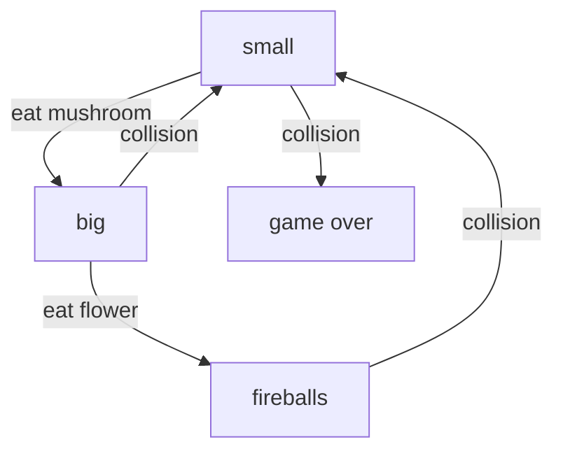

## State Machines

Before we try to animate anything, it's important to have some familiarity with
the idea of "state machines".  When an actor has a finite set of configurations,
and certain events determine how it transitions among those configurations, a
State Machine provides an elegant way to explain it all.  For example, if you're
familiar with the original Super Mario Bros game, you'll recall that Mario
starts "small".  If he eats a mushroom, he gets "big".  If he then eats a
flower, he gets firepower.  If he hits an enemy and is small, the level ends.
Otherwise, he shrinks.  We can express these rules very succinctly with a State
Machine diagram:

The diagram is unambiguous, and it also shows unintuitive things (like the way
that Mario doesn't go from "fireballs" to "big", but instead all the way back to
"small").

The reason that state machines are so important to Animations is that JetLag
needs to have a small library of animations on hand just to make a single
animated actor look good.  For example, if one Animation sequence works well for
an actor walking from left to right ("east"), then we'd want a different
sequence for walking from right to left ("west").  In fact, we might want eight
different directions (north, south, east, west, northeast, southeast, northwest,
southwest).  We might also want animations for when the actor is idle (not
walking) but facing in one of these eight directions.  We might also want
animations for jumping while moving in one of 8 directions, and for jumping
while standing still.  And also crawling.  And also when the hero is invincible.
Or tossing a projectile.  That's a lot!

Putting it all together, in JetLag we have 80 possible states.  It actually
should be more, but we skip a few things, like "tossing while jumping while
invincible".  The 80 states consist of one of 10 behaviors, multiplied by 8
directions:

- IDLE (IDLE_N, IDLE_NE, IDLE_E, IDLE_SE, IDLE_S, IDLE_SW, IDLE_W, IDLE_NW): The actor is not moving, and is facing in one of 8 directions
- WALK (WALK_N, WALK_NE, WALK_E, WALK_SE, WALK_S, WALK_SW, WALK_W, WALK_NW): The actor is moving in one of 8 directions
- TOSS_IDLE (TOSS_IDLE_N, TOSS_IDLE_NE, TOSS_IDLE_E, TOSS_IDLE_SE, TOSS_IDLE_S, TOSS_IDLE_SW, TOSS_IDLE_W, TOSS_IDLE_NW): The actor is not moving, and is tossing a projectile
- TOSS (TOSS_N, TOSS_NE, TOSS_E, TOSS_SE, TOSS_S, TOSS_SW, TOSS_W, TOSS_NW): The actor is moving and tossing
- INV_IDLE (INV_IDLE_N, INV_IDLE_NE, INV_IDLE_E, INV_IDLE_SE, INV_IDLE_S, INV_IDLE_SW, INV_IDLE_W, INV_IDLE_NW): The actor is stationary and invincible
- INV (INV_N, INV_NE, INV_E, INV_SE, INV_S, INV_SW, INV_W, INV_NW) The actor is moving and invincible
- JUMP_IDLE (JUMP_IDLE_N, JUMP_IDLE_NE, JUMP_IDLE_E, JUMP_IDLE_SE, JUMP_IDLE_S, JUMP_IDLE_SW, JUMP_IDLE_W, JUMP_IDLE_NW) The actor is jumping in place
- JUMP (JUMP_N, JUMP_NE, JUMP_E, JUMP_SE, JUMP_S, JUMP_SW, JUMP_W, JUMP_NW): The actor is jumping while walking
- CRAWL_IDLE (CRAWL_IDLE_N, CRAWL_IDLE_NE, CRAWL_IDLE_E, CRAWL_IDLE_SE, CRAWL_IDLE_S, CRAWL_IDLE_SW, CRAWL_IDLE_W, CRAWL_IDLE_NW): The actor is crouching, but not moving
- CRAWL (CRAWL_N, CRAWL_NE, CRAWL_E, CRAWL_SE, CRAWL_S, CRAWL_SW, CRAWL_W, CRAWL_NW) The actor is crouching and moving in one of 8 directions

Not all games will use all 80 of these states.  In addition, sometimes we want
to use a single Animation sequence for several of the states.
