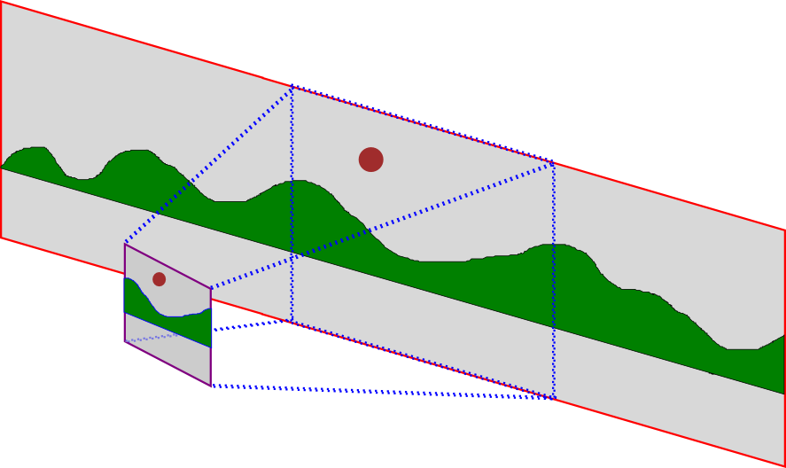

## The Camera

In many games, the world is too big to fit on the screen all at once.  Instead,
only a part of the world is displayed.  The easiest way to think about how this
works is by imagining that there is a camera filming your world.  The camera
should follow the action, zoomed in on the most important part.  The following
picture can be helpful in understanding the idea:

In the picture, the shape with the red outline is the world.  The shape with the purple outline is the camera.  The blue dotted lines show a projection from the world onto the camera, so that we can see just a portion of the world at any time.

In the rest of this chapter, we're going to combine a camera with gravity to
make four different styles of game.  You can access the camera via
`stage.world.camera`, but you'll find that most of the functions of the camera
(the camera's "methods") aren't really there for you to use... they exist so
that JetLag can interact figure out what part of your game to put on the screen.
