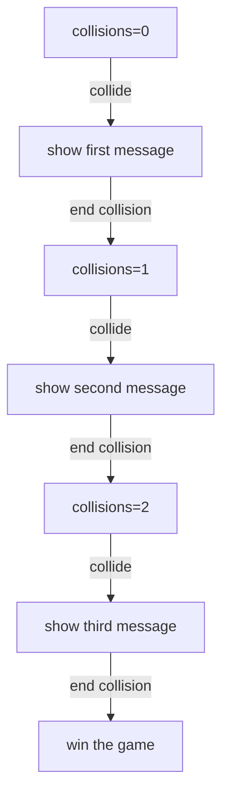

## Responding To The End Of A Collision

Everything we've looked at so far deals with when collisions *start*. Sometimes,
we want to do something when the collision *ends*.  In this example, each time
the hero collides with the obstacle, it puts a different message on the screen.
You can think of this as the start of the kind of interaction you might have in
an RPG style of game.

<iframe src="./game_05.iframe.html"></iframe>

The first part of this code just sets up the hero:

```typescript
    enableTilt(10, 10);
    let h = new Actor({
      appearance: new ImageSprite({ width: 0.8, height: 0.8, img: "green_ball.png" }),
      rigidBody: new CircleBody({ cx: 2, cy: 3, radius: 0.4, }),
      movement: new TiltMovement(),
      role: new Hero(),
    });
```

There are two things to understand about the rest of the code.  The first is
that we're going to make an ad hoc state machine.  We'll accomplish it using a
number and an array of messages:



Next, let's think about how to get the behavior we want.  When the hero collides
with the obstacle, we'll set up an "end contact" handler.  This code will run
when the hero and obstacle stop being in a collided state.  If they collide
again, we'll need to add a new "end contact" handler, but fortunately, the code
is the same (it's just the value of `collisions` that will change).

Putting it all together, the rest of the example looks like this:

```typescript
    let collisions = 0;
    let messages = ["Please leave me alone", "Why do you bother me so?", "Fine, you win."]
    let o = new Actor({
      appearance: new ImageSprite({ width: 0.8, height: 0.8, img: "mustard_ball.png" }),
      rigidBody: new CircleBody({ cx: 15, cy: 8, radius: 0.4 }),
      role: new Obstacle({
        heroCollision: () => {
          let text = new Actor({
            appearance: new TextSprite({ center: false, face: "Arial", size: 30, color: "#FF00FF" }, () => messages[collisions]),
            rigidBody: new BoxBody({ cx: 12, cy: 6, width: .01, height: .01 })
          });
          (stage.world.physics as AdvancedCollisionSystem).addEndContactHandler(o, h, () => {
            collisions++;
            text.remove();
            if (collisions == 3) stage.score.winLevel();
          });
        }
      }),
    });
```
