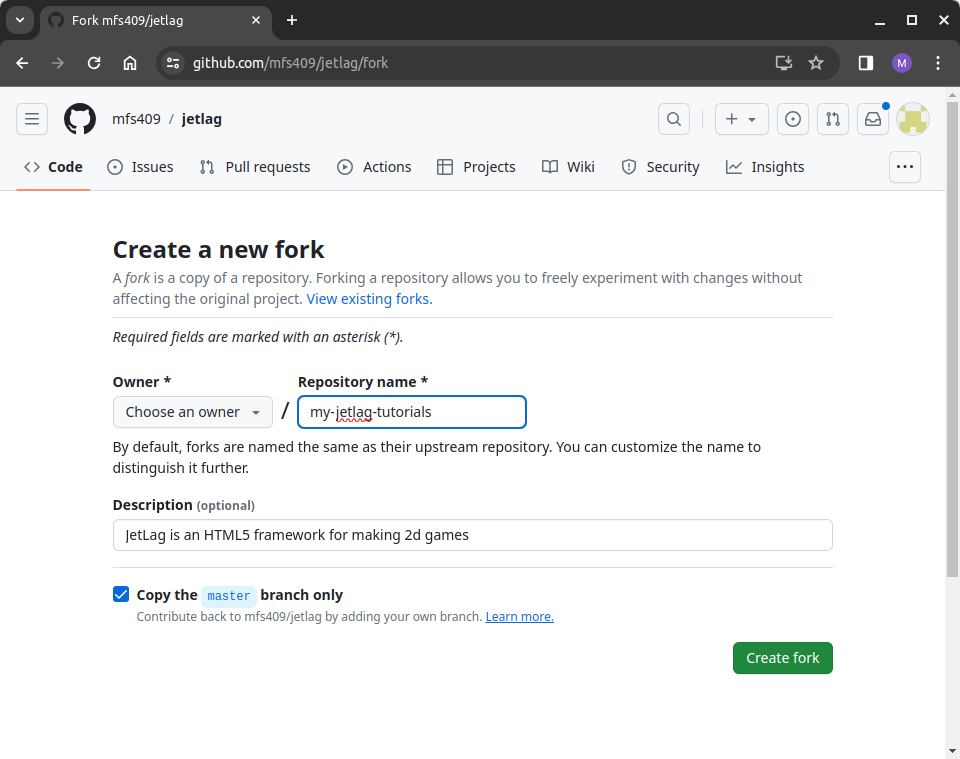

## Step 1: Getting the JetLag Code

The JetLag starter code is hosted on GitHub.  If you don't have a GitHub
account, you should visit [GitHub](http://github.com) to create one.  

Once you have a GitHub account, the easiest way to get started is to "fork" the
JetLag repository on GitHub.  Then go to [The JetLag GitHub
Page](https://github.com/mfs409/jetlag) and click the "fork" button.  You should
change the name from JetLag to the name of your game (when working through this
book, the name `my-jetlag-tutorials` might be a good choice).

If this all sounds strange, don't worry, it's very common.  When you "fork" a
repository, you are essentially saying "give me a copy of the repository that I
can edit."  There are two very nice aspects of forking:

- The `git` tool will give you an easy way to back up your code to the GitHub
  website at any time.
- You can still get updates from the repository you forked.  So whenever I
  update JetLag, you can `git pull` from my version into yours, to get the
  latest features.

If this seems to confusing, then you can ignore almost all of it.  As long as
you "fork" the JetLag repository, you'll have a copy of the code that you can
work with, even if you never use `git` again, and never back up any of your code
to GitHub.

If, on the other hand, you *want* to use `git`, but feel like you need more
information, one place to start is this [Git
tutorial](https://www.cse.lehigh.edu/~spear/tutorials/viewer.html#cse216_git/tut.md).
This will be especially useful if you are new to `git`, and want to follow the
"hard" path for setting up your computer.
