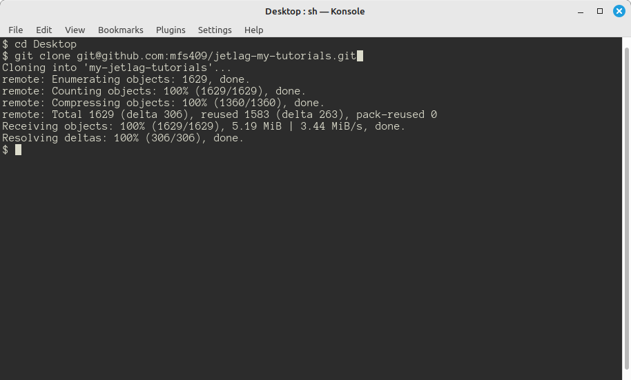

## Step 2 (hard path): Setting Up Your Computer

Before embarking on this path, please keep in mind that Windows, MacOS, and
Linux can be quite different to set up, and the steps might change every few
months, as different programs change in subtle ways.  Please treat this chapter
as a guide, and be ready for small differences between what it says and what
works on your computer.

### Installing the Software

You will need the following programs in order to work with JetLag.  Please note
that if you want to make your game from a phone or ChromeBook, you'll want to
take the StackBlitz route:

- A terminal and `git`
    - Every major operating system has at least one terminal program (some even
      have more than one).  It should not matter which terminal you use, but you
      will need to have the `git` program installed.  Briefly, `git` is a
      *source control* tool.  At a minimum, you'll use it to get a copy of the
      starter code.  In most cases, you'll want to use `git` to manage your code
      as you develop it.
- Node.js (`node`) and the Node Package Manager (`npm`)
    - JetLag uses `node` and `npm` to transform your code into a format that can
      be run inside a browser.  Note: you probably want to use the "LTS"
      version of node.js.
- A web browser
    - Any modern browser will do.  JetLag has been tested on Chrome, Edge, and
      Firefox.
- An editor
    - Strictly speaking, you can use any program that can edit text.  However,
      since JetLag uses the TypeScript programming language, you will probably
      find that Visual Studio Code ("VSCode") offers many benefits and makes
      your experience much nicer.

Below are links to tutorials for helping you to install these programs.

- Windows Instructions
    - [Git Bash for Windows](https://www.educative.io/answers/how-to-install-git-bash-in-windows)
    - [Visual Studio Code](https://code.visualstudio.com/docs/setup/windows)
    - [Node.js and NPM](https://www.geeksforgeeks.org/installation-of-node-js-on-windows/)

- MacOS Instructions
    - [Git](https://git-scm.com/book/en/v2/Getting-Started-Installing-Git)
    - [Visual Studio Code](https://code.visualstudio.com/docs/setup/mac)
    - [Node.js and NPM](https://nodejs.org/en/download/package-manager#macos)

After you've installed `git`, `VSCode`, `node.js`, and `npm`, follow these steps to make sure they're working correctly:

- Open a terminal
- Type `node --version` and press `<enter>`.
- Type `npm --version` and press `<enter>`.
- Type `git --version` and press `<enter>`.
- Type `code --version` and press `<enter>`

The output in your terminal should look something like this:


### Configuring the Software

If this is your first time installing `git`, you may need to do a little bit of
additional configuration.  Type the following commands in your terminal (Note:
you should use *your* name and email):

```bash
git config --global init.defaultBranch main
git config --global user.email "rsmith123@some.email.address.com"
git config --global user.name "Riley Smith"
git config --global pull.rebase false
```

You will also want to do a little bit of configuration in VSCode.  You can get
to the settings in VSCode by pressing `F1`, typing `settings` into the search
box, and then choosing "Open Settings (UI)".

- Using the search bar, find "Editor: **Format On Save**" and set it to true.
- Then find "Typescript > Format: **Enable**" and be sure to check it.

Finally, since you are going to be using `git` from the command line, you will
need to set up "ssh keys". These provide a secure way of interacting with
GitHub.  For help, see [these
instructions](https://docs.github.com/en/authentication/connecting-to-github-with-ssh/adding-a-new-ssh-key-to-your-github-account).

### Copying the Code and Running It

Now it's time to get the code from your repository onto your computer.  In
`git`, this is known as "cloning".  Cloning refers to copying all the files from
your repository in the cloud onto your development machine.  When you make
changes to your code, they won't go to the cloud automatically. Instead, you can
periodically "commit" snapshots of your code, and then "push" them to GitHub.
This means that you can work through something tricky, and only back it up to
GitHub when you're sure it's good.

Navigate to the GitHub website, go to your projects, and click the green "Code"
button.  There will be an "ssh" option, and a corresponding statement like
`git@github.com:my-username/my-jetlag-tutorials.git`.  Copy that text.

Next, open a terminal and go to the place where you want to check out your code.
I'll be lazy in this chapter, and check out the code to my `Desktop` folder. So
from the terminal, I would type `cd Desktop` to go from my home folder into the
desktop folder.  You can, of course, go to any folder that makes sense.

Now type `git clone XXX`, where `XXX` is the text that you copied from the
GitHub website (in my case, I'd type `git clone
git@github.com:my-username/my-jetlag-tutorials.git`).  This will take a minute
to copy all the code from your fork of my repository.  It will put everything in
a subfolder of the current folder (so, in my case,
`Desktop/my-jetlag-tutorials`).



To go into that folder, type `cd my-jetlag-tutorials`.  If you list the files in
that folder (by typing `ls`), you'll see that the code is all there.  But it's
not ready to use.  The problem is that JetLag relies on some *other* code.  If
you type `npm install`, then the rest of the code that you need will be copied
to your computer.


To test out the code, type `npm start`.  You should see something like the
following:


There will be a line that says something like `Local → http://localhost:7000`.
This means that your game is ready to test out.  Open a web browser and go to
the address that appears after the arrow (so, in my case,
`http://localhost:7000`). You should see something like this:


Congratulations!  Your game is up and running.
