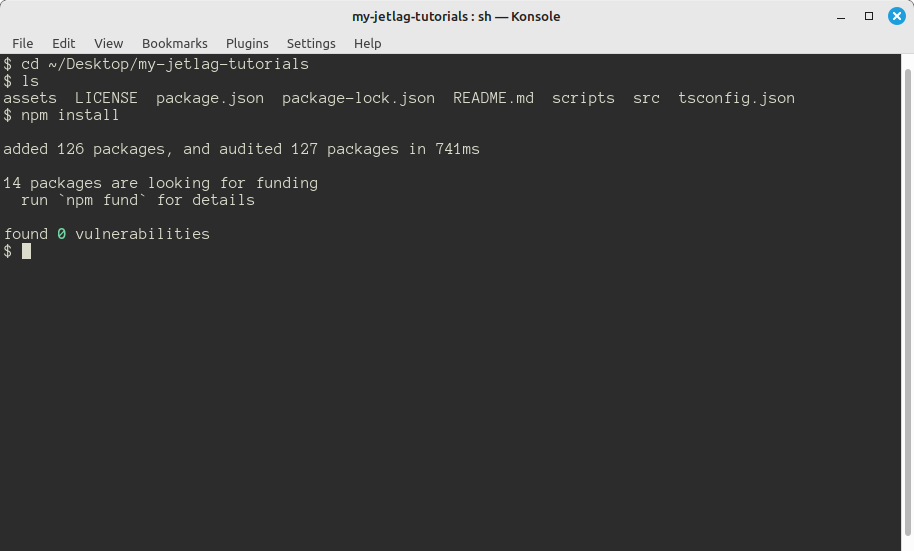
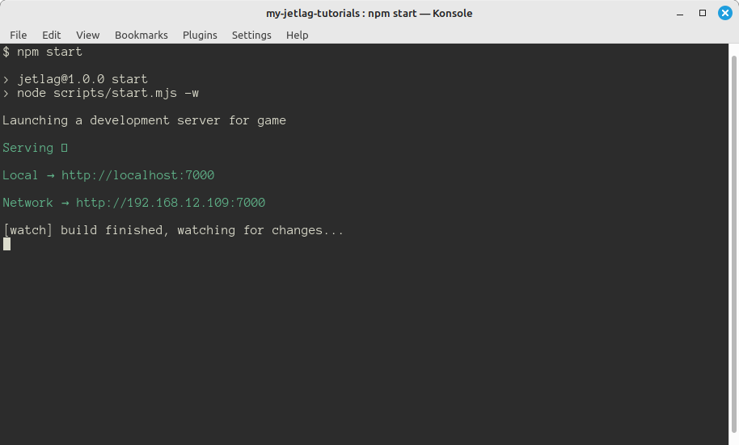
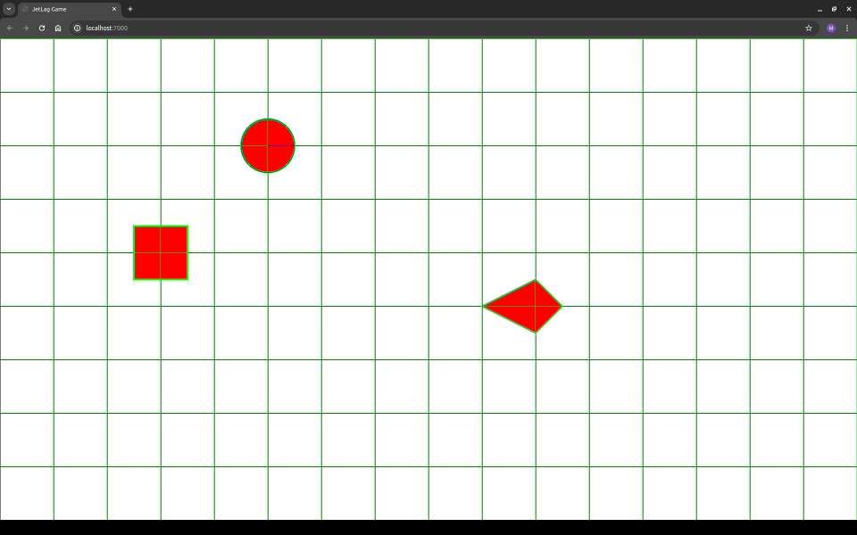

## Running for the First Time

Now that you've forked the repository, it's time to "clone" it.  Cloning refers
to copying your repository from the cloud onto your development machine.  When
you make changes to your code, they won't go to the cloud automatically.
Instead, you can periodically "commit" snapshots of your code, and then "push"
them to GitHub.  This means that you can work through something tricky, and only
back it up to GitHub when you're sure it's good.

Navigate to the GitHub website, go to your projects, and click the green "Code"
button.  There will be an "ssh" option, and a corresponding statement like
`git@github.com:my-username/jetlag-my-tutorials.git`.  Copy that text.

Next, open a terminal and go to the place where you want to check out your code.
I'll be lazy in this tutorial, and check out the code to my `Desktop` folder. So
from the terminal, I would type `cd Desktop` to go from my home folder into the
desktop folder.  You can, of course, go to any folder that makes sense.

Now type `git clone XXX`, where `XXX` is the text that you copied from the
GitHub website (in my case, I'd type `git clone
git@github.com:my-username/jetlag-my-tutorials.git`).  This will take a minute
to copy all the code from your fork of my repository.  It will put everything in
a subfolder of the current folder (so, in my case,
`Desktop/jetlag-my-tutorials`). To go into that folder, type `cd
jetlag-my-tutorials`.

If you list the files in that folder (by typing `ls`), you'll see that the code
is all there.  But it's not ready to use.  The problem is that JetLag relies on
some *other* code.  If you type `npm install`, then the rest of the code that
you need will be copied to your computer.

To test out the code, type `npm start`.  You should see something like the
following:

There is a line that says something like `Local → http://localhost:7000`.  This
means that your game is ready to test out.  Open a web browser and go to the
address that appears after the arrow (so, in my case, `http://localhost:7000`).
You should see something like this:

Congratulations!  Your game is up and running.
