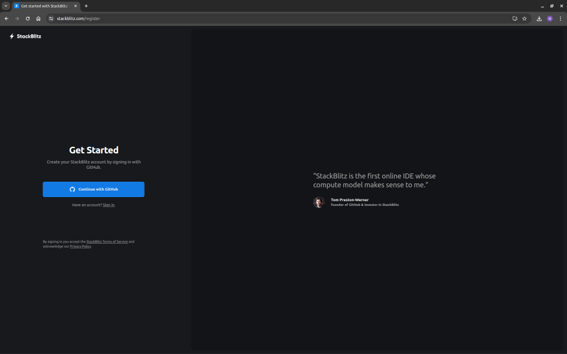
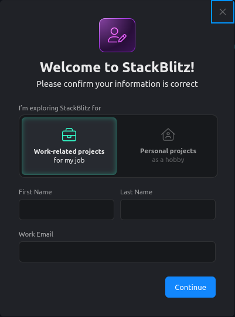
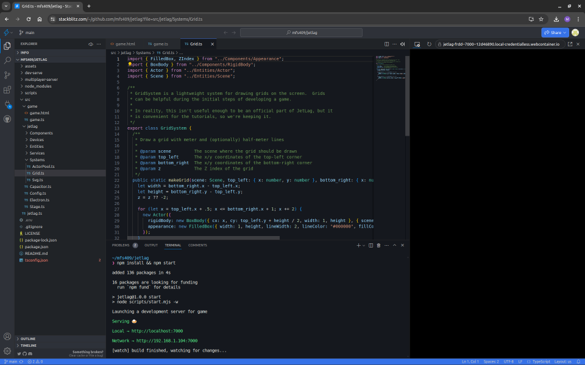
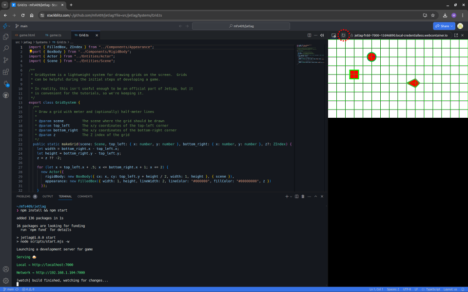
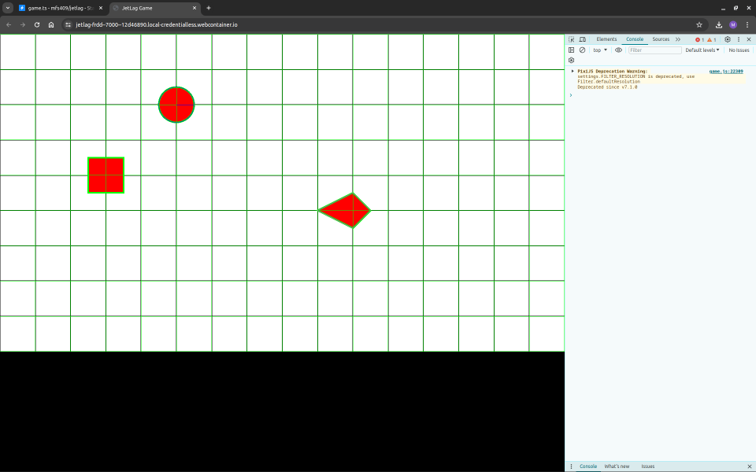

## Step 2 (easy path): Setting Up StackBlitz

There are many third-party tools that make it possible for you to write and test
code straight from your browser.  In this chapter, we'll look at how to set up
[StackBlitz](https://stackblitz.com/) for making games with JetLag.

The first step is to create an account on StackBlitz.  You can do this by
visiting the StackBlitz website and clicking on the "Get started" button.  It should bring you to a page like this:

From here, you can choose "Continue with GitHub", and then follow the prompts to
finish creating your account.  You will probably encounter a screen like this:

While working through the book, "Hobby" is a fine choice.  If you eventually
decide to commercialize your game, you shouldn't keep using StackBlitz.  When
you reach that point, be sure to work through the "hard path" in this chapter.
Note that StackBlitz will probably send you an email to confirm your identity,
so keep an eye on your inbox... some features may not work until you confirm.

Now that you are in StackBlitz, you can choose the "Repositories" option on the
left side.  It will list all of your GitHub repositories, at which point you can
choose your new JetLag repository.  After a few seconds, you should see
something like this:

There is one problem.  Your game should be running on the right hand side, but
if your experience is like mine, you'll just see a black screen.  Fortunately,
clicking the "reload" button (see the dashed circle in the image below) will fix
this problem, and your game will run on the right hand side.

As convenient as this is, there is a problem.  The game is *tiny*!  Furthermore, if there are errors in your code, it's nice to see them through the "Developer Console".  But opening the console (by clicking on the game and then pressing `F12`) takes up even more space.

To get around this, you can click the pop-out button in the top right corner.  A
new tab will open, and once you click the "Connect" button, you should see your
game running in a full-size tab.  This makes it much easier to see the details in your game, and pressing `F12` doesn't take up too much space.

If you've made it this far, you've finished the "easy path", and can skip the
next part of this chapter.