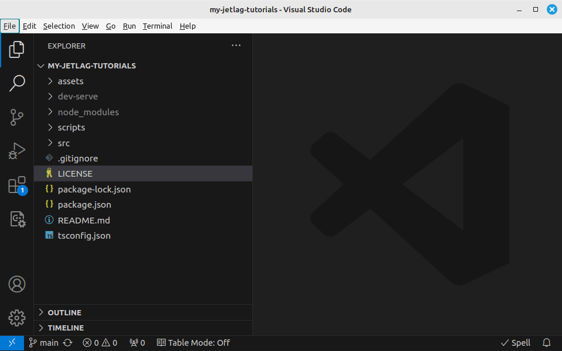

## About the Code

Next, let's open up the code in VSCode.  When you work in VSCode, it is useful
to think about *folders*, not just *files*.  In our case, that means you will
want to use VSCode to open the *folder* that is the root of your checkout.  You
can either do this by opening VSCode and then going to `File/Open Folder`, or
from the terminal, by going into the folder you want to view and then typing
`code .` (don't forget the period!).  Either way, you should then see something
like this:



```admonish Note
If the left side panel is collapsed, click the topmost icon in the left
icon bar.
```

On the left, you'll see a few files and folders:

- `assets` - This is where you should put any images, sounds, or other files
  that support your game.
- `dev-serve` - You can ignore this.  It's where `node` puts stuff while you're
  testing your code.
- `multiplayer-server` - This folder has code that you may need if you want to
  make a multiplayer game.
- `node_modules` - You can ignore this.  It's where `npm` puts the things it
  needs in order for your game to work (that is, the stuff it downloaded when
  you typed `npm install`).
- `scripts` - You can ignore this.  It's just has some code for helping `npm`
  to know how to run your code
- `src` - This has two sub-folders.  `src/jetlag` is where the JetLag code can
  be found.  `src/game` is where your game code should go.
- `.gitignore` - This file tells `git` that some folders and files, such as
  `node_modules` and `dev-serve`, shouldn't get backed up to GitHub.
- `LICENSE` - This file explains that you're free to use the JetLag code however
  you want.
- `package-lock.json` - This file is created by `npm`.  You can ignore it.
- `package.json` - This file is used by `npm`.  You probably won't need to work
  with this until your game gets very advanced.
- `README.md` - A file describing the repository.  For now, it describes
  JetLag itself, but you may eventually change it.
- `tsconfig.json` - Another configuration file that you can ignore for a long
  time.

If that all seems confusing, don't worry.  When you're starting out, pretty much
all that matters is that there is a folder called `src/game`, with two files:
`game.html` and `game.ts`.  In the next chapter, we'll look at how to start
changing the code in these files to make your own game.
