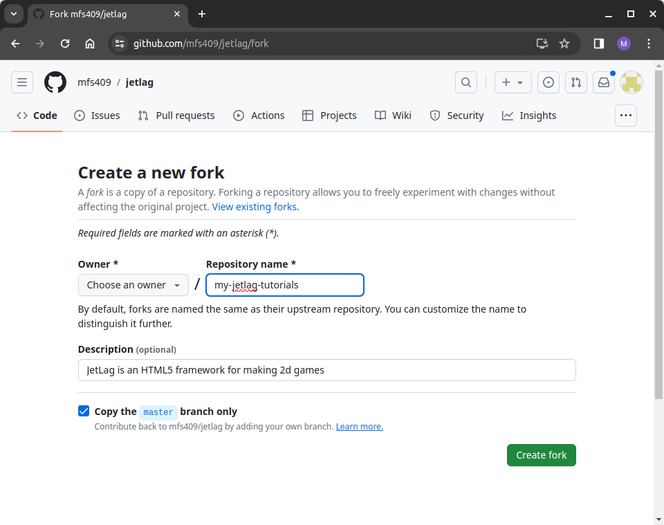

## Getting the JetLag Code

The JetLag starter code is hosted on GitHub.  The easiest way to get started is
to "fork" the JetLag repository on GitHub.  If you don't have a GitHub account,
you should visit <http://github.com> to create a count.  Then go to
<https://github.com/mfs409/jetlag> and click the "fork" button.  You should
change the name from JetLag to the name of your game (when working through this
book, the name `my-jetlag-tutorials` might be a good choice).

If this all sounds strange, don't worry, it's very common.  When you "fork" a
repository, you are essentially saying "give me a copy of the repository that I
can edit."  There are two very nice aspects of forking:

- Your code is *also* on GitHub, which means you can back up your code any time
  you want and save it to the cloud.
- You can still get updates from the repository you forked.  So whenever I
  update JetLag, you can "pull" from my version into yours, to get the latest
  features.

If git seems daunting, you may want to have a look at this [Git
tutorial](https://www.cse.lehigh.edu/~spear/tutorials/viewer.html#cse216_git/tut.md).

After you've got a GitHub account, you will also need to set up "ssh keys".
These provide a secure way of interacting with GitHub.  For help, see [these
instructions](https://docs.github.com/en/authentication/connecting-to-github-with-ssh/adding-a-new-ssh-key-to-your-github-account).
