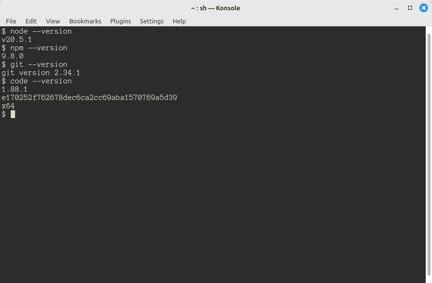

## Required Software

You will need the following programs in order to work with JetLag.  Please note
that we do not currently support development on phones or ChromeBooks:

- A terminal and `git`
    - Every major operating system has at least one terminal program (some even
      have more than one).  It should not matter which terminal you use, but you
      will need to have the `git` program installed.  Briefly, `git` is a
      *source control* tool.  At a minimum, you'll use it to get a copy of the
      starter code.  In most cases, you'll want to use `git` to manage your code
      as you develop it.
- Node.js (`node`) and the Node Package Manager (`npm`)
    - JetLag uses `node` and `npm` to transform your code into a format that can
      be run inside a browser.  Note: you probably want to use the "LTS"
      version of node.js.
- A web browser
    - Any modern browser will do.  JetLag has been tested on Chrome, Edge, and
      Firefox.
- An editor
    - Strictly speaking, you can use any program that can edit text.  However,
      since JetLag uses the TypeScript programming language, you will probably
      find that Visual Studio Code ("VSCode") offers many benefits and makes
      your experience much nicer.

Below are links to tutorials for helping you to install these programs.

- Windows Instructions
    - [Git Bash for Windows](https://www.educative.io/answers/how-to-install-git-bash-in-windows)
    - [Visual Studio Code](https://code.visualstudio.com/docs/setup/windows)
    - [Node.js and NPM](https://www.geeksforgeeks.org/installation-of-node-js-on-windows/)

- MacOS Instructions
    - [Git](https://git-scm.com/book/en/v2/Getting-Started-Installing-Git)
    - [Visual Studio Code](https://code.visualstudio.com/docs/setup/mac)
    - [Node.js and NPM](https://nodejs.org/en/download/package-manager#macos)

After you've installed `git`, `VSCode`, `node.js`, and `npm`, follow these steps to make sure they're working correctly:

- Open a terminal
- Type `node --version` and press `<enter>`.
- Type `npm --version` and press `<enter>`.
- Type `git --version` and press `<enter>`.
- Type `code --version` and press `<enter>`

The output in your terminal should look something like this:

