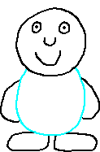

## The Hard Part: Assets

The hardest part of a good character creation screen is not the code.  The hard
part is making a bunch of images that can work nicely together.  It's extra hard
if the images need to be animated.  To keep things easy, in this chapter we'll
build a single `ImageSprite`.  The concepts are the same, so from there you'll
be able to figure out how to make animations, so that you can build awesome
characters.

We're going to use the following character:

.  

You'll notice that the character does not have hair, and that there are only
four colors: transparent, white, black, and blue.  The blue outline is
temporary... it's going to help me to split the image into a bunch of parts.
When done, we'll go down to three colors: white, black, and transparent.

I also drew some really shoddy hairstyles.  Here they are:

- [Hair option #1](../assets/hair_01.png)
- [Hair option #2](../assets/hair_02.png)
- [Hair option #3](../assets/hair_03.png)

These are simple two-color images: white and transparent.  From here, I chopped
up the character into its parts, and then I combined them into a spritesheet:

- [dude.json](../assets/dude.json)
- [dude.png](../assets/png.json)

In the spritesheet, I colored the pupils of the eyes red.  The color I chose
isn't important.  What matters is that there are different colors, so that I can
use filters to selectively replace one color with another.
