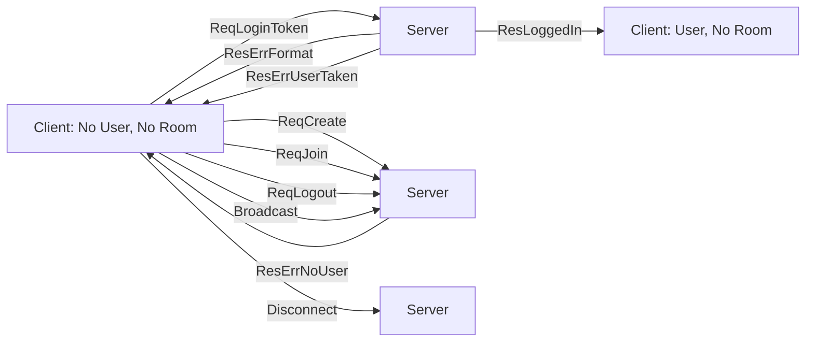
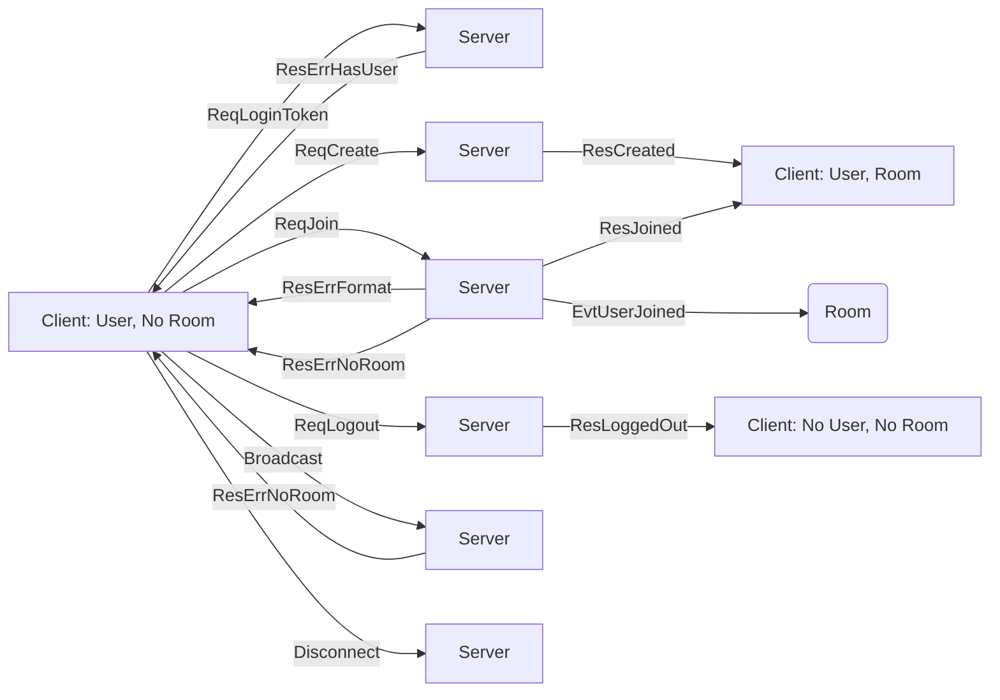
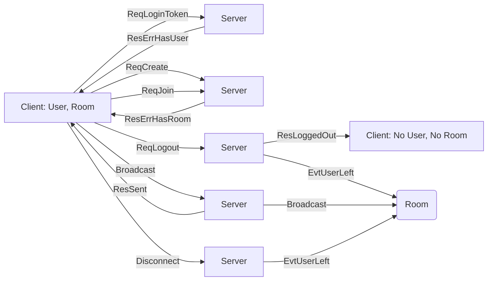

## Authentication Flows

In a game that is available on the internet, you *must not* let users pretend to
be other people.  One of the most common techniques is to use an "OAuth"
provider, such as a user's Google or Facebook Id.  We're **not** going to do
that in this chapter.  Instead, we're going to blindly trust that a user is who
they say they are.  This gets us a simpler state machine, and makes it easier to
understand the concepts.  But remember: this is not good code to use if you want
to put your game online!

In your JetLag repository, you'll find a folder called `multiplayer-server`.  It
has code that implements a simple multiplayer server, where users need to join a
"Room" in order to play together.  Let's look at its state machine.  In the
diagram below, arrows represent messages between the client and server.  The
state of the client is given by the text after the `:` character.  So then this
diagram shows that when the client is just starting out (No User, No Room), if
it sends the server `ReqLoginToken` ("request: log in, using a token"), and the
token is valid, then the server will respond with `ResLoggedIn` ("response: you
are logged in").  But it could also respond with `ResErrFormat` ("response: your
token was not formatted correctly") or `ResErrUserTaken` ("response: this user
is already logged in").

The diagram also shows that there are four messages that the client is not
allowed to send yet, because the client is not logged in yet.  They are
`ReqCreate`, `ReqJoin`, `ReqLogout`, and `Broadcast`, and the server will tell
the not-yet-logged-in client `ResErrNoUser` ("response: there is no logged in
user, so this request is an error").

Finally, if the client disconnects, it is as-if the client sent a "disconnect"
message to the server, but the server does not respond to the client (because it
can't).

This next diagram shows the flow when a user is logged in but does not yet have
a room.  If they provide a valid room name and send `ReqJoin` to the server,
they'll get a response of `ResJoined`, and will now be in the room.  Similarly,
the user can use `ReqCreate` to request that a new room is created.  Most other
requests still produce an error, but it's different now: erroneous requests do
not reset the client to "No User, No Room".  That only happens on `ReqLogout`.
Otherwise, the server responds with an error, and the client stays in the same
state.

In the diagram, there is one more subtlety: When a user joins an existing room,
the server sends a message "to the room".  This actually means the server sends
a message to every client who is in that room.  The message lets the clients
know that there is another person in the room.

Finally, when the user is logged in and has a room, there are three interesting
events: they can disconnect (for example, if their network fails), they can log
out (which notifies everyone in the room), or they can broadcast a message to
the whole room.  As you probably guessed, broadcasting is how you could
implement another state machine inside the game, or could just be a way of
sharing notifications (such as the character's position).

One last thing is worth mentioning.  In the JetLag `multiplayer-server`, data is
sent in a text format known as JSON.  This format looks a lot like typescript
code.  It uses more bytes than other formats, but it's easy to understand,
because it looks just like TypeScript (well, actually, JavaScript) code.  For
example, if you had a variable `a` that looked like this: `let x = {a: 10, b:
20}`, then you could convert it to a JSON string via the statement
`JSON.stringify(x)`, and you'd get back `'{"a":10,"b":20}'`.  You could then
turn this back into an object via `JSON.parse()`.
