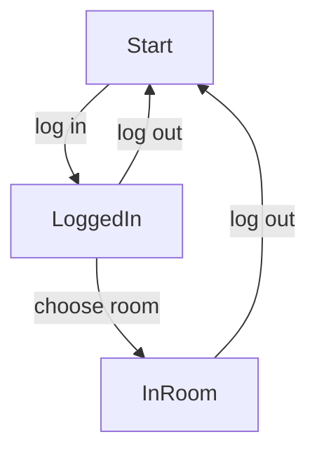

## Review: State Machines

In the animations chapter, we discussed state machines briefly.  You'll probably
not be surprised to learn that state machines are also a key concept in
networked games.

To help understand why, consider a game where users must log in, then choose a
"room", and then they can interact with everyone else in that room.  We need
three states just to handle the flow from starting the game to being able to
play!

What about after a user is in the room?  At that point, it's up to you.  You may
need another state machine for handling the kinds of events that happen in the
game.  Or, if your game is simpler, it may suffice to have each player broadcast
to the other members of the room whenever certain high-importance events happen.
