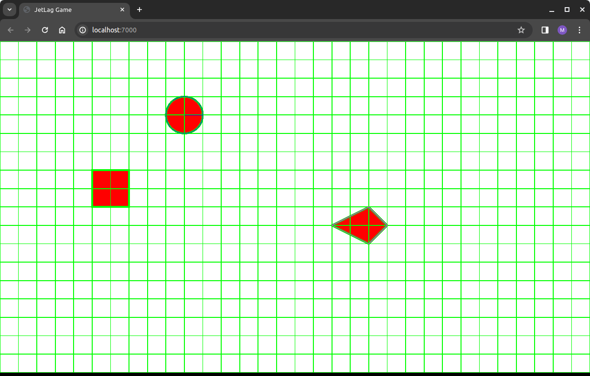
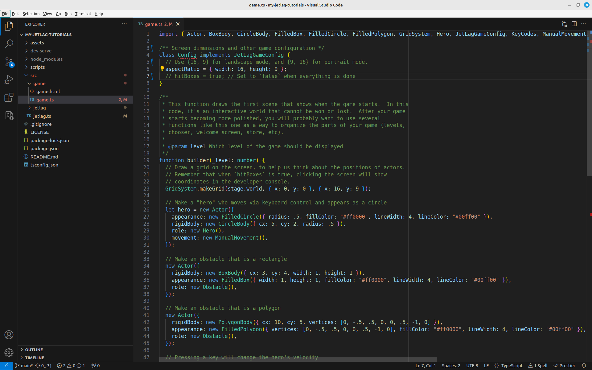

## The Parts of the Default Game

Let's start by trying to understand the default game that comes with JetLag.
When you cloned the last chapter and ran the game, you should have seen
something like this:



Our goal right now is to understand why.  There are two important files.  The
first is `src/game/game.html`.  It is the file that defines the structure of the
web page that you're seeing in your browser.  If you open it in VSCode, you
should see something like this:

```html
{{#include ../empty/game.html}}
```

```admonish Note
Most of this file is not going to change very much from one game to the next.
If you don't understand all the details, it's OK.
```

The `head` section describes the general appearance of the web page.  It has
some `meta` tags that explain how mobile web browsers should stretch the page so
it looks good on a small screen.  It has a `style` tag, which makes sure that
the page fills the screen.  Finally, it has a `title`, which is what appears as
your game name in the browser tab or browser title bar.  The first thing you
should do whenever you start making a new game is update the title.

The `body` only has two parts.  The first is a `div` tag, named `game-player`,
which is where the game is going to appear.  The name `game-player` is very
important.  When we get to the `game.ts` file, we'll see why it matters.  The
other thing is a `script` tag.  This tells the web browser that the code to run
will be called `game.js`.  You probably don't want to change anything in the
`body` section.

Now let's move on to the second file.  It is called `src/game/game.ts`.  First
of all, notice that it is not `game.js`.  That's because it *only* has the code
that you write, not all of the JetLag stuff (and Pixi.js stuff, and Box2D
stuff).  When you type `npm start`, then `game.ts` gets combined with all those
other things to produce the `game.js` file that the web page expects.

```admonish Note
`npm start` is the command to use while working on your game: it makes a version
of `game.js` for your browser to use while you're working.  You can also type
`npm check` to see if there are any errors in your code.

When you're ready to put your game somewhere that other people can access, 
you'll use `npm build`.  It does mostly the same thing as `npm start`, but in a
way that makes files that are ready to put on the web.
```

There are four important parts of `game.ts`.  The first the `import` statements
that appear at the top of the file.  These indicate which parts of JetLag your
game needs.  For now, they're all on one line, and you can just leave them
as-is.  Later, you'll learn how to get VSCode to automatically update the
imports as you start using new features of JetLag.  That part of the file should
look like this:

```typescript
{{#include ./game.ts:1}}
```

The second part of the file is where we provide JetLag with some configuration
for our game. You will need is to tell JetLag the width and height of your game.
These values are in meters, because that's how Box2D works.  JetLag will use
Pixi.js to stretch the game to fit your screen.  You will also need to tell
JetLag if it should draw "hit boxes" around the things in the game.  When you're
developing a game, it's good to set this to `true`.  You can make it `false`
once you are sure everything is good.

```typescript
{{#include ./game.ts:3:10}}
```

One important thing is that all of this code is defined as a `class` that
`implements` something called `JetLagGameConfig`.  All that really means is that
I've made sure that if you forget any of the required parts of the
configuration, you will get an error.  You can try it out.  Put `//` in front of
one of the lines (perhaps `hitBoxes = true;`) and watch what happens.  `Config`
gets a red underline, and if you hover your mouse over it, you'll see an error
message.



As you make progress on your game, you'll discover that there are many optional
fields that you can add to this class.  Don't worry about it for now.

The third part of the file is where we put our actual game code.  In later
chapters, we'll learn how to split this apart, since a game's code can get
quite long.  We'll look at this code in more detail in the next section of the
chapter.  For now, what matters is that it is a "function".  A function is a
block of code that we can run any time we want.  It turns out that JetLag itself
will decide when to call this function.  The function takes an argument called
`level`, which lets it do different things depending on which level of the game
is being drawn.  `level` is a variable.  It has to be there, but we don't use
it, so we prefix its name with an `_`, to indicate that we aren't going to use
it.

Remember that this function creates the *initial state* of the game.  It runs to
completion before you get to play the game, and anything that happens during
gameplay is because of decisions the physics simulator makes, or events that
occur.

```typescript
{{#include ./game.ts:12:58}}
```

The last part of the file is a call to `initializeAndLaunch`.  This is what
leads to your game actually running.  You'll notice that we have the name of the
`div` from the HTML file in here.  In essence, this says "find that div, make a
game according to the rules in `Config` and `builder`, and then put the game
into that div".

```typescript
{{#include ./game.ts:60:62}}
```

One last note: you can change names like `Config` and `builder`, but when you
do, make sure you change them everywhere!
