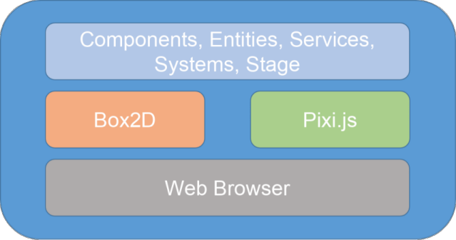

## Software Foundations

There is very little software that doesn't rely on other software.  When someone
writes code and shares it, with the expectation that other people will use that
code (but not modify it!), we call their code a "library".

JetLag relies on two important libraries.  The first is Box2D.  Box2D is an
industrial-strength physics simulator.  A programmer can use Box2D to create a
"world", put shapes into that world, and then see how those shapes move and
collide.  The second important library is Pixi.js.  Pixi.js is a library for
drawing 2D images.  Note that Box2D doesn't know anything about drawing, and
Pixi.js doesn't know anything about physics.  However, they both do know about
shapes, such as circles, rectangles, and polygons.

Pixi.js and Box2D are general-purpose libraries... they can be used to make
games, but also for many other purposes.  The main goal of JetLag is to provide
a clean and easy way to develop games, by providing a game-specific interface to
Pixi.js and Box2D.  JetLag tries to give you common building blocks for making
games.  These building blocks should be easier to use than working with Box2D
and Pixi.js directly.  Another goal is that you should still be able to reach
down into the full power of Pixi.js and Box2D when you need to.

The following picture gives a sense for how everything fits together:

At the top-most level, JetLag provides Components, Entities, Services, Systems,
and a Stage, which represent the key parts of your game.  We're going to discuss
these in this chapter.  These pieces of JetLag are built from Box2D and Pixi.js,
which are in the middle level. JetLag hides all the details of Box2D and
Pixi.js, so that it's not overwhelming to get started writing games. Finally, at
the bottom, Pixi.js and Box2D interact with a web browser, which displays the
game, receives input, etc.

One way in which JetLag is different than many libraries is that we expect each
game to end up customizing JetLag at some point.  When you write a game with
JetLag, you copy the JetLag code into your folder, right next to the code you
write. That way, when things start to get complicated, and you need to use more
of the power of Box2D and Pixi.js, you can make changes to JetLag that make
those features visible.  One important aspect of this design is that your code
can evolve over time, gradually using more and more of Box2D and Pixi.js.  This
design will help you to avoid the problem illustrated in the next picture:

Before we look at some code, there is one more important topic to discuss.  If
you're looking at that first picture and thinking "I don't want my game to run
in a web browser", JetLag is still a good tool for you.  In later tutorials,
we'll show you how to use tools like [Capacitor](https://capacitorjs.com/) and
[Electron](https://www.electronjs.org/) to run your game as a mobile or desktop
app.
