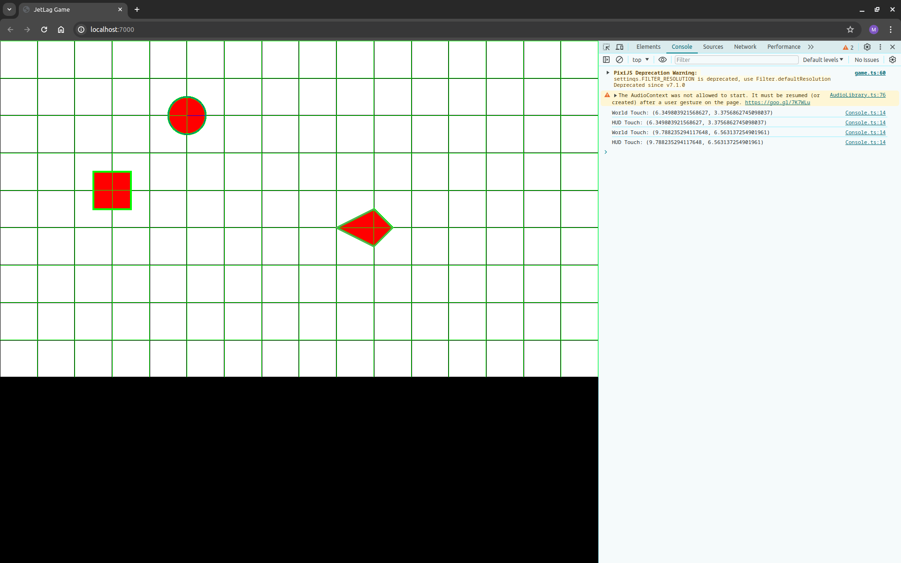

## Breaking Down the Builder

Now let's look at what's happening inside of the `builder` function.

### The Grid

Like most game engines, JetLag uses the Entity-Component-System (ECS) pattern.
Every actor in the game is an "Entity", and has certain special "Components"
attached to it.  These components give actors different behaviors and
appearances.  "Systems" are kind of vague, but you can think of a System as
being something that manages many entities.

The first thing you'll see in the game is this line:

```typescript
  // Draw a grid on the screen, to help us think about the positions of actors.
  // Remember that when `hitBoxes` is true, clicking the screen will show
  // coordinates in the developer console.
  GridSystem.makeGrid(stage.world, { x: 0, y: 0 }, { x: 16, y: 9 });
```

This draws the grid that you see on the screen.  If you open the developer
console in your browser (in Chrome or Firefox: press F12, then pick console),
and then click anywhere on the screen, you should see that the coordinates of
your click are reported in the console:



Right now, "World Touch" and "HUD Touch" are the same.  We'll get to this in a
later tutorial.  For now, you can ignore "HUD Touch".

It turns out that the GridSystem is making lots and lots of lines.  Each of them
is an Actor, but they're more like props than anything else... they don't move,
and they don't get in the way of the things that can move.  The Grid is just
there to help you when you get started, so let's not think about it in any more
detail.

What is much more interesting is how the world relates to our `Config` object.
The Config object asked for a screen that was 1600x900 meters, with a
pixel-to-meter ratio of 100.  It also asked to adapt to the screen size.  If you
resize your browser and refresh, you'll see that the game resizes, so it is
always going to be in a 16x9 ratio (with black bars on the left/right or
top/bottom, as necessary).  No matter what size your browser window, the game
will be scaled so that it shows a simulated world that is 16x9 meters.

### The Hero

Actors are the main kind of entity in JetLag.  The lines of the Grid were
actually actors, but it's not really useful to think about them like that,
because they're just there as a guide while we're getting started.  

Instead, let's look at the three clusters of code that make Actors, since they
are the ones that make this "game" interesting.  Every Actor must have an
appearance and a rigidBody.  There are other components that can be added, but
they're optional.  

Let's look at the first actor:

```typescript
  // Make a "hero" who moves via keyboard control and appears as a circle
  let hero = new Actor({
    appearance: new FilledCircle({ radius: .5, fillColor: "#ff0000", lineWidth: 4, lineColor: "#00ff00" }),
    rigidBody: new CircleBody({ cx: 5, cy: 2, radius: .5 }),
    role: new Hero(),
    movement: new ManualMovement(),
  })
```

In this code we are making an actor.  This actor is going to get used in some
code later, so we give it a name (`hero`) so that it is easy to keep track of
it. For its appearance, we make a circle with radius .5, which means it will
have a width of 1 and a height of 1.  We color it red (`#FF0000`), and give it a
green border that is 4 pixels wide.

We make the body as a circle that also has radius .5.  We could have the
appearance be something other than a circle, or a circle with a different
radius, but in this game, that wouldn't be useful.  The `cx` and `cy` values
specify the coordinates of the center of the circle.  Remember that the top-left
corner of the world is (0, 0), with X increasing as we move left, and Y
increasing as we move down.

This actor's role is `Hero`.  Usually the hero is the focal point of the game.
In this game, all that means is that the hero isn't a prop... by default,
heroes' rigidBody components will collide with other things that can are
supposed to collide.  (The grid didn't have a role, so it doesn't collide with
the hero.  The obstacles (below) have roles that cause them to collide with the
hero.)

The last component we attached to this actor is its movement.  The
`ManualMovement` component indicates that we're going to use code to manually
move this actor around.  That will be important when we get to the last part of
the code.

### The Obstacles

The next part of the code makes two obstacles.  They are actors, but they don't
have a `movement`, so we should expect that they're not going to be able to
move.  Looking at these, we see that they follow the same pattern as the hero,
but we don't assign them to variables (because we don't want to make changes to
them later).  One has a box shape, and the other has a polygon shape.

```typescript
  // Make an obstacle that is a rectangle
  new Actor({
    rigidBody: new BoxBody({ cx: 3, cy: 4, width: 1, height: 1 }),
    appearance: new FilledBox({ width: 1, height: 1, fillColor: "#ff0000", lineWidth: 4, lineColor: "#00ff00" }),
    role: new Obstacle(),
  })

  // Make an obstacle that is a polygon
  new Actor({
    rigidBody: new PolygonBody({ cx: 10, cy: 5, vertices: [0, -.5, .5, 0, 0, .5, -1, 0] }),
    appearance: new FilledPolygon({ vertices: [0, -.5, .5, 0, 0, .5, -1, 0], fillColor: "#ff0000", lineWidth: 4, lineColor: "#00ff00" }),
    role: new Obstacle(),
  })
```

Boxes are pretty easy to understand: they just have a width and a height.  But
that polygon is kind of tricky.  Polygons must be convex, and we define them by
providing the (x,y) coordinates of their vertices, in clockwise order.  These
coordinates are relative to the center of the polygon.  So in this code, we're
saying that one point is at (0, -.5) relative to the center, the next is at (.5,
0), the next at (0, .5), and the last at (-1, 0).  These are the left, top,
right, and bottom vertices, respectively.  Note, again, that we make the
`rigidBody` and the `appearance` identical.

Finally, each of these obstacles has a role of `Obstacle`.  For now, that just
means "the hero can collide with it".

One quick note: the appearance right now is pretty bland, because we're just
drawing solid shapes.  In a later tutorial, you'll see that we can use pictures,
or animations (sequences of pictures), to make a much more visually appealing
game.

### Events

If we ran the game as-is, nothing would happen... the world would just stay
stationary forever.  That's not going to be very fun, so the last part of the
code is going to make it possible for the player to control the hero.  We do
this through events.

```typescript
  // Pressing a key will change the hero's velocity
  stage.keyboard.setKeyUpHandler(KeyCodes.KEY_UP, () => (hero.movement as ManualMovement).updateYVelocity(0));
  stage.keyboard.setKeyUpHandler(KeyCodes.KEY_DOWN, () => (hero.movement as ManualMovement).updateYVelocity(0));
  stage.keyboard.setKeyUpHandler(KeyCodes.KEY_LEFT, () => (hero.movement as ManualMovement).updateXVelocity(0));
  stage.keyboard.setKeyUpHandler(KeyCodes.KEY_RIGHT, () => (hero.movement as ManualMovement).updateXVelocity(0));
  stage.keyboard.setKeyDownHandler(KeyCodes.KEY_UP, () => (hero.movement as ManualMovement).updateYVelocity(-5));
  stage.keyboard.setKeyDownHandler(KeyCodes.KEY_DOWN, () => (hero.movement as ManualMovement).updateYVelocity(5));
  stage.keyboard.setKeyDownHandler(KeyCodes.KEY_LEFT, () => (hero.movement as ManualMovement).updateXVelocity(-5));
  stage.keyboard.setKeyDownHandler(KeyCodes.KEY_RIGHT, () => (hero.movement as ManualMovement).updateXVelocity(5));
```

In the above code, we are dealing with two kinds of events: keyboard
down-presses of keys, and keyboard up-presses of keys.  If you hover your mouse
over `setKeyUpHandler`` in VSCode, you should see some pop-up help.  In fact,
you should be able to hover over just about *anything* in the code and get help.
In this case, the help says that we are providing code to run whenever some key
is up-pressed (that is, when the key is released).

We are using the TypeScript language, and in TypeScript, we can make functions
any time we want, by using syntax of the form `()=>{}`.  Sometimes we can
simplify this slightly, to `()=>code`, when the code is just one line.  So in
this case, we have eight lines of code, which say that for each arrow key, we'll
provide code to run when the key is pressed and when the key is released.

In each case, we'll update the hero's velocity (via its movement component)
according to the key press.

In the window below, you'll find an embedded, playable version of the game.  Be
sure to click it, then use the arrow keys.  The hero should move around, and
should collide with the obstacles.  You might also want to turn on the developer
console as you play, to see messages as you click the screen.

<iframe src="./game_01.iframe.html"></iframe>

In the above code, I kind of glossed over one thing: the "stage".  You can think
of the stage as an Entity, but a special one... there's only one stage in the
game, and it has special features that actors don't have.  In this case, it's
the only thing that understands keyboard events, via `stage.keyboard`.  We'll
explore this in further detail in later tutorials.
